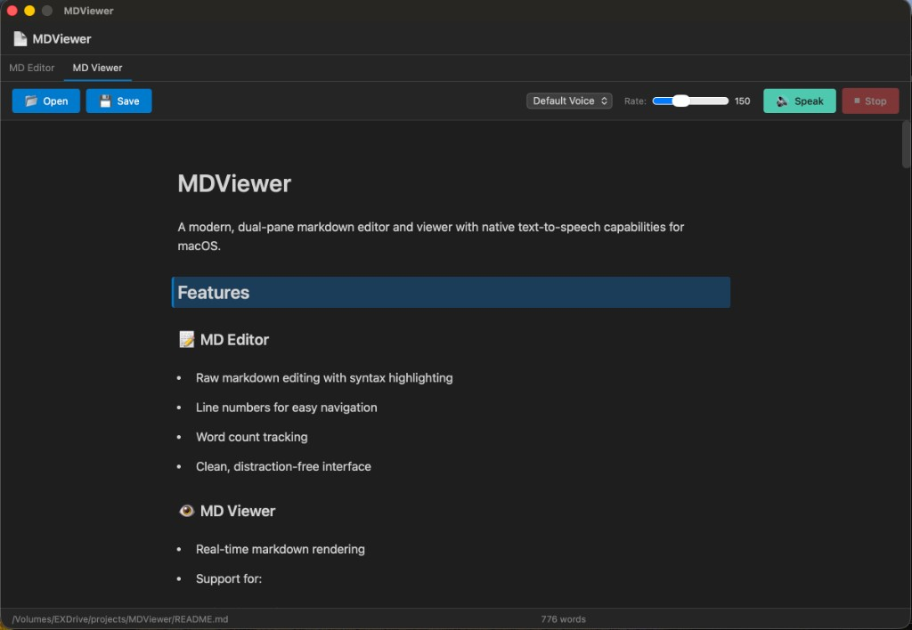

# MDViewer

A modern, dual-pane markdown editor and viewer with native text-to-speech capabilities for macOS.

## Features

### 📝 MD Editor
- Raw markdown editing with syntax highlighting
- Line numbers for easy navigation
- Word count tracking
- Clean, distraction-free interface

### 👁️ MD Viewer
- Real-time markdown rendering
- Support for:
  - Headers (H1-H6)
  - Bold, italic, and inline code
  - Lists (ordered and unordered)
  - Blockquotes
  - Code blocks
  - Links
  - Horizontal rules
- Click any word to select reading start position

### 🔊 Text-to-Speech (TTS)
- Native macOS TTS integration using the `say` command
- Multiple voice options
- Adjustable speech rate (100-250 words per minute)
- Click-to-select reading position
- Visual line highlighting during speech
- Stop/Start controls

## Requirements

- macOS 10.13 or later
- Native macOS text-to-speech (pre-installed)

## Installation

### From Source

1. Install Go 1.21 or later
2. Install Wails CLI:
   ```bash
   go install github.com/wailsapp/wails/v2/cmd/wails@latest
   ```
3. Clone and build:
   ```bash
   git clone <repository-url>
   cd MDViewer
   ./build.sh
   ```
4. The built app will be in `build/bin/MDViewer.app`

### Running in Development Mode

```bash
wails dev
```

### Quick Scripts

Two convenient shell scripts are provided:

- **`./build.sh`** - Builds the production application
- **`./run.sh`** - Launches the built application

```bash
# Build and run
./build.sh
./run.sh
```

## Usage

### Opening Files
1. Click the **Open** button in the toolbar
2. Select a `.md`, `.markdown`, or `.txt` file
3. The file content will load in both Editor and Viewer tabs

### Editing
1. Switch to the **MD Editor** tab
2. Type or edit your markdown content
3. Use the **Save** button to save changes

### Viewing and Reading
1. Switch to the **MD Viewer** tab to see rendered markdown
2. Click on any word in the viewer to set the reading position
3. Select a voice from the dropdown (optional)
4. Adjust the speech rate slider (optional)
5. Click **Speak** to start text-to-speech
6. Click **Stop** to halt reading

## Keyboard Shortcuts

Currently, all actions are toolbar-based. Future versions may include keyboard shortcuts.

## Technical Stack

- **Backend**: Go 1.23
- **Framework**: Wails v2.11.0
- **Frontend**: Vanilla JavaScript, HTML5, CSS3
- **Build Tool**: Vite
- **TTS**: Native macOS `say` command

## Project Structure

```
MDViewer/
├── app.go                  # Main Go application and TTS logic
├── frontend/
│   ├── src/
│   │   ├── main.js         # Frontend application logic
│   │   ├── app.css         # Main styles
│   │   └── style.css       # Base styles
│   ├── index.html          # HTML structure
│   └── package.json        # Frontend dependencies
├── build/                  # Build output directory
├── wails.json              # Wails configuration
└── go.mod                  # Go dependencies
```

## Design Specifications

### Color Palette
- **Primary Background**: `#1E1E1E` (Dark editor background)
- **Secondary Background**: `#252526` (Panels and toolbars)
- **Accent Color**: `#007ACC` (Buttons and highlights)
- **Text Primary**: `#D4D4D4`
- **Text Secondary**: `#808080`
- **Highlight Line**: `#2D4F1E` (Reading highlight)
- **Success Button**: `#4EC9B0` (Speak button)
- **Danger Button**: `#F14C4C` (Stop button)

### Typography
- **Editor Font**: SF Mono, Menlo, Monaco (monospace)
- **UI Font**: -apple-system, system default
- **Font Size**: 14px (editor), 13px (UI)

## Known Limitations

1. TTS only works on macOS (uses native `say` command)
2. File operations use native dialogs (browser-based file access removed)
3. Markdown rendering is custom (not using a full parser library)
4. No collaborative editing features
5. No syntax highlighting for code blocks (planned for future)

## Troubleshooting

### TTS Not Working
- Ensure your Mac has text-to-speech enabled in System Preferences
- Check that the `say` command works in Terminal: `say "Hello"`
- Try selecting a different voice from the dropdown

### File Won't Open
- Ensure the file has a `.md`, `.markdown`, or `.txt` extension
- Check file permissions

### Build Errors
- Ensure Wails CLI is installed: `wails doctor`
- Check Go version: `go version` (must be 1.21+)
- Clean and rebuild: `wails build -clean`

## Future Enhancements

- [ ] Syntax highlighting for code blocks in viewer
- [ ] Export to HTML/PDF
- [ ] Recent files list
- [ ] Keyboard shortcuts
- [ ] Themes (light mode)
- [ ] Advanced markdown features (tables, footnotes)
- [ ] Word-by-word highlighting during TTS
- [ ] Pause/Resume TTS functionality
- [ ] Bookmark/annotation support

## Contributing

This is a personal/educational project. Feel free to fork and modify for your needs.

## License

[Specify your license here]

## Credits

- Built with [Wails](https://wails.io)
- Uses macOS native TTS
- Inspired by the need for accessible markdown reading tools

## Screenshot

 

*MDViewer showing the MD Viewer tab with text-to-speech controls and rendered markdown content*

## Contact

For questions or suggestions, contact: tazzu.far@gmail.com
